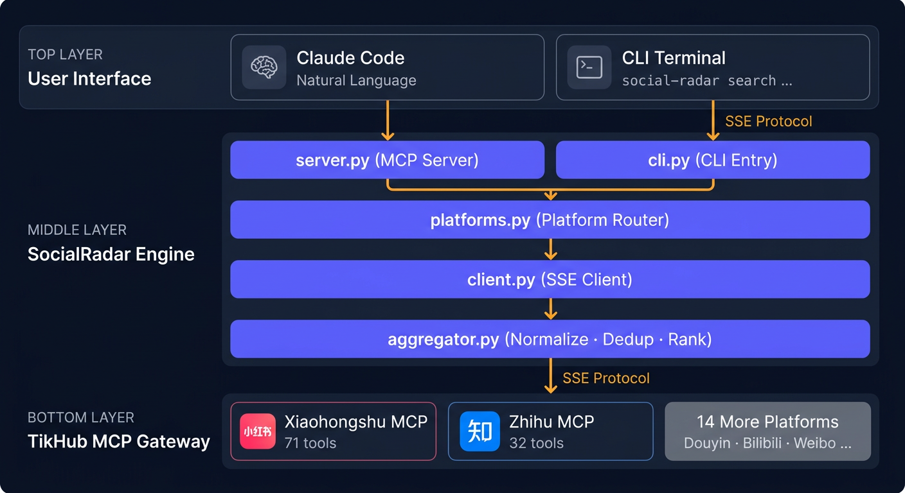
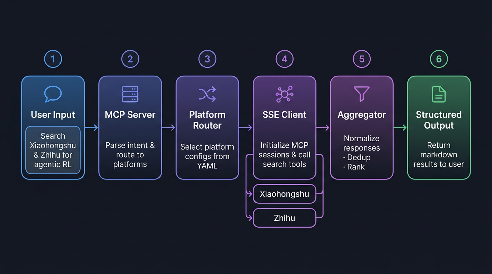

<p align="center"><a href="https://python.org"></a> <a href="LICENSE"></a> <a href="https://modelcontextprotocol.io"></a>  </p>

<br>

<div align="center">
  <pre style="font-size: 12px; line-height: 1.2; color: #6366f1; background: none; border: none; margin: 0; padding: 0;">
 ██████╗  ██████╗  ██████╗██╗ █████╗ ██╗     ██████╗  █████╗ ██████╗  █████╗ ██████╗ 
██╔════╝ ██╔═══██╗██╔════╝██║██╔══██╗██║     ██╔══██╗██╔══██╗██╔══██╗██╔══██╗██╔══██╗
╚█████╗  ██║   ██║██║     ██║███████║██║     ██████╔╝███████║██║  ██║███████║██████╔╝
 ╚═══██╗ ██║   ██║██║     ██║██╔══██║██║     ██╔══██╗██╔══██║██║  ██║██╔══██║██╔══██╗
██████╔╝ ╚██████╔╝╚██████╗██║██║  ██║███████╗██║  ██║██║  ██║██████╔╝██║  ██║██║  ██║
╚═════╝   ╚═════╝  ╚═════╝╚═╝╚═╝  ╚═╝╚══════╝╚═╝  ╚═╝╚═╝  ╚═╝╚═════╝ ╚═╝  ╚═╝╚═╝  ╚═╝
  </pre>
</div>

<p align="center">
  <strong>一句话，扫遍多个社交平台。</strong><br>
  <sub>AI 原生的跨平台社交媒体搜索引擎 — 基于 <a href="https://modelcontextprotocol.io">MCP</a> 和 <a href="https://tikhub.io">TikHub</a></sub>
</p>

<p align="right">
  🌐 <b>中文</b> &nbsp;|&nbsp; <a href="README.md">English</a>
</p>
<br>

---

## 💡 为什么需要 SocialRadar？

在中文技术社区搜索求职面经、行业动态、技术讨论，痛点非常具体：

- **碎片化** — 小红书、知乎、B 站……每个平台独立搜索框，格式各异
- **重复劳动** — 同一关键词输入 3 遍，同一内容在不同平台反复翻到
- **转瞬即逝** — 标签页关了就没了，没有持久记录

SocialRadar 用**统一搜索接口**解决这个问题，直接嵌入你的 AI 工作流。

> *"帮我搜一下小红书和知乎上关于 Agentic RL 面试的经验帖"*  
> *"找找最近关于 DeepSeek-R1 训练流程的讨论"*  
> *"2025 年大模型算法岗就业市场怎么样？"*

一句话。跨平台搜索。结构化结果。就在你的 IDE 里。

<table>
<tr>
<td width="50%" align="center" style="padding: 12px;"><b>🔄 传统工作流</b></td>
<td width="50%" align="center" style="padding: 12px;"><b>⚡ 有了 SocialRadar</b></td>
</tr>
<tr>
<td style="padding: 8px 16px; vertical-align: top;">
<p>❌ 手动打开 2+ 个 App / 网页</p>
<p>❌ 逐条复制粘贴手动汇总</p>
<p>❌ 切换标签页丢失上下文</p>
<p>❌ 无法集成 AI</p>
<p>❌ 一次只搜一个平台</p>
<p>❌ 结果散落难以对比</p>
</td>
<td style="padding: 8px 16px; vertical-align: top;">
<p>✅ 一句话描述搜索需求</p>
<p>✅ 自动跨平台聚合</p>
<p>✅ 结果持久化在对话记录中</p>
<p>✅ 原生 Claude Code MCP 支持</p>
<p>✅ 一次搜索覆盖全平台</p>
<p>✅ 归一化、去重、按热度排序</p>
</td>
</tr>
</table>

<br>

<table align="center">
<tr>
<td align="center" width="25%"><h3>🔍</h3><b>跨平台</b><br><sub>统一搜索小红书<br>知乎，一次查询<br>覆盖多平台</sub></td>
<td align="center" width="25%"><h3>🧠</h3><b>AI 原生</b><br><sub>Claude Code MCP<br>深度集成<br>动口不动手</sub></td>
<td align="center" width="25%"><h3>🔌</h3><b>热插拔</b><br><sub>YAML 配置 +<br>一个 normalizer<br>即可新增任意平台</sub></td>
<td align="center" width="25%"><h3>📊</h3><b>结构化输出</b><br><sub>格式归一化<br>跨平台去重<br>按互动量排序</sub></td>
</tr>
</table>

---

## 🚀 快速开始

### 环境要求

| 依赖 | 版本/说明 | 备注 |
|---|---|---|
| **Python** | 3.11+ | 需要 asyncio、类型提示支持 |
| **TikHub API Key** | — | [免费注册获取](https://tikhub.io) |

### 安装

```bash
git clone https://github.com/your-username/SocialRadar.git && cd SocialRadar
pip install -e .
cp .env.example .env
```

编辑 `.env`，填入凭证：

```ini
# TikHub API Key — 从 https://tikhub.io 获取
TIKHUB_API_KEY=tikhub_xxxxxxxxxxxxx
```

验证安装：

```bash
social-radar platforms
# 应输出：小红书 (xiaohongshu), 知乎 (zhihu)
```

---

## 📖 使用方式

### 🧠 方式一：Claude Code MCP 集成 *(推荐)*

在 Claude Code 的 `settings.json` 中添加：

```json
{
  "mcpServers": {
    "social-radar": {
      "command": "python",
      "args": ["-m", "social_radar.server"],
      "env": { "TIKHUB_API_KEY": "tikhub_xxxxxxxxxxxxx" }
    }
  }
}
```

重启 Claude Code 后，即可通过自然对话使用 **3 个搜索工具**：

| 工具 | 描述 | 适用场景 |
|---|---|---|
| `social_radar_search` | 跨平台搜索 | 通用搜索，自动覆盖所有平台 |
| `social_radar_xiaohongshu` | 仅小红书 | 面经、求职分享、技术科普 |
| `social_radar_zhihu` | 仅知乎 | 深度技术讨论、问答、论文解读 |

**对话示例：**

```
> 帮我在小红书上搜一下大模型算法求职面经

> 知乎上关于 GRPO 和 PPO 训练的最新讨论有哪些？

> 帮我同时搜小红书和知乎，找找 agentic RL 方向的求职经验帖，
  以及相关技术讨论
```

### ⌨️ 方式二：CLI 命令行

```bash
# 基础跨平台搜索
social-radar search "agentic RL 面试"

# 指定平台
social-radar search "RLHF 训练流程" -p zhihu
social-radar search "大模型面试经验" -p xiaohongshu

# 高级用法
social-radar search "DeepSeek-R1 架构" -p xiaohongshu -n 20
social-radar search "MCP 协议" --json | jq '.[] | {title, url, likes}'
social-radar search "reward hacking" -p zhihu,xiaohongshu

# 工具命令
social-radar platforms              # 列出所有支持平台
social-radar search --help          # 查看完整 CLI 参考
```

<details open>
<summary><b>📟 终端效果预览</b></summary>

```
╭─────────────────── 搜索结果：「agentic RL 面试」 ───────────────────╮
│ # │ 平台   │ 标题                           │ 作者      │ 点赞  │
│ 1 │ 小红书 │ Agent方向大模型面试总结…          │ AI求职笔记  │ 1.2k  │
│ 2 │ 知乎   │ 如何看待 agentic RL 成为新热点？  │ 王某某     │ 856   │
│ 3 │ 小红书 │ RL算法岗面试经验全分享            │ ML_Engineer│ 623   │
│ 4 │ 知乎   │ GRPO 算法原理解析与面试题整理      │ Li-Paper  │ 491   │
│ 5 │ 小红书 │ 字节跳动AML面试回顾               │ OfferCat  │ 387   │
└──────────────────────────────────────────────────────────────────┘
共 15 条结果 · 从 2 个平台共 23 条原始结果去重得到
```

</details>

---

## 🔧 配置详解

### 平台配置 (`config/platforms.yaml`)

每个平台为一个 YAML 块，结构如下：

```yaml
xiaohongshu:                          # 平台 key（-p 参数使用）
  name: 小红书                          # 显示名称
  endpoint: https://mcp.tikhub.io/...  # TikHub MCP 端点
  search_tool: xiaohongshu_app_v2_search_notes  # 主搜索工具
  search_params:                       # 默认参数
    keyword: "{query}"                 # {query} = 用户输入占位符
    page: 1
    sort_type: general
    note_type: 不限
    time_filter: 不限
  note_link_template: "https://www.xiaohongshu.com/explore/{note_id}"
  max_results: 20
```

### 环境变量

| 变量 | 必填 | 说明 |
|---|---|---|
| `TIKHUB_API_KEY` | 是 | TikHub API 认证密钥 |
| `SOCIAL_RADAR_CONFIG` | 否 | 自定义 YAML 配置文件路径（默认：`config/platforms.yaml`） |
| `SOCIAL_RADAR_MAX_RESULTS` | 否 | 覆盖每个平台的最大返回数（默认：20） |

### 新增一个平台

**第一步** — 在 `config/platforms.yaml` 添加配置块：

```yaml
bilibili:
  name: B站
  endpoint: https://mcp.tikhub.io/bilibili/mcp
  search_tool: bilibili_web_search_videos
  search_params:
    keyword: "{query}"
    page: 1
```

**第二步** — 在 `src/social_radar/aggregator.py` 添加归一化函数：

```python
def normalize_bilibili(raw: dict, platform_cfg) -> list[SearchResult]:
    """将 B 站搜索结果解析为统一的 SearchResult。"""
    results = []
    items = raw.get("data", {}).get("items", [])
    for item in items:
        results.append(SearchResult(
            platform="bilibili",
            platform_name="B站",
            title=item.get("title", ""),
            url=item.get("url", ""),
            summary=item.get("description", ""),
            author=item.get("owner", {}).get("name", ""),
            likes=item.get("stat", {}).get("like", 0),
        ))
    return results
```

完成。新平台自动出现在 CLI 和 MCP 工具中。

---

## 🏗 架构设计

<p align="center">
  
</p>

### 三层设计

| 层级 | 模块 | 职责 |
|---|---|---|
| **界面层** | `server.py` · `cli.py` | 双入口：MCP stdio 服务（供 Claude Code 调用）+ 独立 CLI |
| **引擎层** | `platforms.py` · `client.py` · `aggregator.py` | YAML 平台注册表、SSE 协议客户端、跨平台结果归并 |
| **网关层** | TikHub MCP 端点 | 各平台 MCP 服务，通过标准化 SSE 协议暴露搜索工具 |

### 数据流

<p align="center">
  
</p>

```
用户输入 → [server.py / cli.py] → [platforms.py] → [client.py] → TikHub MCP
                                                          ↳ 小红书 API
                                                          ↳ 知乎 API
结果返回 ← [aggregator.py] ← 归一化 ← 去重 ← 排序 ← [client.py]
```

### 关键设计决策

- **为什么用 SSE 而不是 WebSocket？** — TikHub 使用标准 MCP SSE 协议。搜索请求-响应模式不需要双向持久通道，WebSocket 会增加不必要的复杂度。
- **为什么每个平台单独写 normalizer？** — 各平台返回不同的 JSON schema。独立 normalizer 可单独测试和替换，不影响核心引擎。
- **为什么用 YAML 配置？** — 人类可读、diff 友好、修改参数无需改代码。用户可自定义搜索默认值而不动 Python。

---

## 🌐 支持的平台

> 聚焦中文技术社区 AI 从业者活跃的平台。全部 16 个 TikHub 平台均可扩展 — [查看如何新增](#新增一个平台)。

<table>
<tr>
<td align="center" width="50%">
  
  &nbsp;<b>小红书</b> &nbsp; <code>xiaohongshu</code>
  <br><br>
  <b>搜索工具：</b> <code>app_v2_search_notes</code> · <code>web_v2_fetch_search_notes</code><br>
  <b>内容类型：</b> 笔记、图文、视频笔记<br>
  <b>最适合：</b> 面经 · 求职分享 · 技术科普 · 行业动态<br>
  <b>备注：</b> 搜索结果优先按互动量（点赞、收藏、评论）排序
</td>
<td align="center" width="50%">
  
  &nbsp;<b>知乎</b> &nbsp; <code>zhihu</code>
  <br><br>
  <b>搜索工具：</b> <code>article_search_v3</code> · <code>ai_search</code> · <code>topic_search_v3</code><br>
  <b>内容类型：</b> 文章、回答、专栏、话题<br>
  <b>最适合：</b> 深度技术讨论 · 问答 · 论文解读 · 行业分析<br>
  <b>备注：</b> <code>ai_search</code> 支持 LLM 总结回答，附带引用来源
</td>
</tr>
</table>

<p align="center">
  <sub>
    <b>TikHub 已支持（配置即用）：</b><br>
    抖音 · B 站 · 微博 · YouTube · Reddit · Twitter · LinkedIn · 快手 · Threads · 微信
  </sub>
</p>

---

## 📁 项目结构

```
SocialRadar/
├── src/social_radar/
│   ├── __init__.py           # 包元数据 (v0.1.0)
│   ├── server.py             # MCP Server — Claude Code 集成入口
│   ├── cli.py                 # CLI — 独立 Typer 命令行
│   ├── client.py              # TikHub SSE 客户端 (init → tools/call)
│   ├── platforms.py           # YAML 配置加载 + 平台数据模型
│   └── aggregator.py          # 格式归一化 + 去重 + 排序
├── config/
│   └── platforms.yaml         # 平台定义（热插拔）
├── docs/
│   └── images/                # 架构图 & 流程图
├── pyproject.toml              # Python 项目元数据
├── .env.example                # API Key 配置模板
├── .gitignore                  # 排除 .env、__pycache__ 等
├── LICENSE                     # MIT 协议
├── README.md                   # 英文文档
└── README_CN.md                # 中文文档（当前文件）
```

---

## 🗺️ 路线图

| 里程碑 | 状态 | 说明 |
|---|---|---|
| **v0.1** — 核心 | ✅ 已完成 | 小红书 + 知乎搜索，MCP Server，CLI，结果聚合 |
| **v0.2** — 深度输出 | 🚧 规划中 | 笔记详情获取、评论提取、作者信息丰富 |
| **v0.3** — 更多平台 | 📋 计划中 | B 站、微博、抖音 normalizer 适配 |
| **v0.4** — 智能搜索 | 💡 设想 | AI 查询扩展、搜索词推荐、多轮对话优化 |
| **v0.5** — 持久化 | 💡 设想 | 搜索历史、保存查询、Markdown/JSON 导出 |
| **v1.0** — 生产就绪 | 🎯 目标 | 测试覆盖率 >80%、CI/CD、Docker 镜像、完善文档 |

---

## ❓ FAQ

<details>
<summary><b>和直接用 TikHub MCP 有什么区别？</b></summary>
<br>
TikHub <b>每平台一个独立 MCP 端点</b>，需要配置 16 个 MCP Server、记住 200+ 个工具名。SocialRadar 提供<b>统一入口</b>，只有 3 个直觉式的工具：跨平台搜索、仅小红书、仅知乎。跨平台去重、格式归一化、热度排序全部自动完成。
</details>

<details>
<summary><b>搜索结果质量如何？</b></summary>
<br>
SocialRadar 是纯客户端聚合层，结果<b>质量取决于 TikHub 上游 API</b>和各平台原生搜索算法。我们提供的附加值：
<br><br>
<b>(1)</b> 异构响应格式归一化为统一 schema<br>
<b>(2)</b> 基于标题相似度的跨平台去重<br>
<b>(3)</b> 基于互动量（点赞、评论、收藏）的默认排序<br>
<b>(4)</b> 保留原始响应数据供高级用户使用
</details>

<details>
<summary><b>会访问我的个人数据吗？</b></summary>
<br>
<b>不会。</b> SocialRadar 仅调用 TikHub 公开 API。不涉及任何社交账号登录、浏览器 Cookie、个人隐私数据。唯一凭证是本地 <code>.env</code> 文件中的 API Key（已被 <code>.gitignore</code> 排除）。
</details>

<details>
<summary><b>可以不用 Claude Code 吗？</b></summary>
<br>
<b>可以。</b> CLI 模式（<code>social-radar search ...</code>）可在任何终端独立使用。MCP Server 是可选的额外入口，专为需要 AI 集成搜索的 Claude Code 用户提供。
</details>

<details>
<summary><b>速率限制是多少？</b></summary>
<br>
速率限制由你的 <a href="https://tikhub.io">TikHub</a> 订阅计划决定。SocialRadar 本身不加任何额外限流。免费套餐通常支持每分钟数十次搜索——个人使用完全够用。
</details>

<details>
<summary><b>搜索失败如何排查？</b></summary>
<br>
排查清单：<br>
<b>1.</b> 确认 <code>.env</code> 中 <code>TIKHUB_API_KEY</code> 是否正确<br>
<b>2.</b> 运行 <code>social-radar platforms</code> 确认配置加载成功<br>
<b>3.</b> 检查 TikHub 控制台 API 配额状态<br>
<b>4.</b> 使用 <code>--json</code> 参数查看原始 API 响应
</details>

---

## 🤝 贡献

欢迎所有形式的贡献 — 从 Bug 报告到新平台适配。

| 类型 | 方式 | 示例 |
|---|---|---|
| 🐛 **Bug** | 提交 Issue | 搜索返回空、特定关键词崩溃 |
| 🔌 **平台适配** | PR normalizer | 添加微博 / B 站 / 抖音支持 |
| 📝 **文档** | PR README | 修正笔误、添加使用示例、翻译 |
| ✨ **新功能** | 先开 Issue 讨论 | 定时搜索、Markdown 导出等 |

提交 PR 前：确保 `pip install -e .` 成功，CLI 功能正常。

---

## 📄 License

<p align="center">
  MIT License © 2026
</p>

<br>

<div align="center">
  <a href="https://github.com/your-username/SocialRadar">
    
  </a>
</div>

<p align="center">
  <sub>为 AI 社区用 ❤️ 构建 · 由 <a href="https://tikhub.io">TikHub MCP</a> 强力驱动</sub>
</p>
